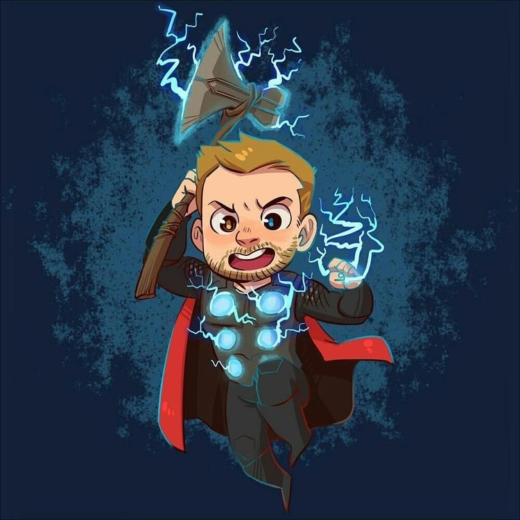

# Инструкция для работы с Markdown

## Выделение текста

Чтобы выделить текст курсивом необходимо обрамить его звездочкам (*) или знаком нижнего подчеркивания (_). Например, *вот так* или _вот так_.

Чтобы выделить текст жирным, надо обрамить его двойными звездочками (**) или двойным знаком нижнего подчеркивания (__). Например, **вот так** или __вот так__.

Альтернатинвые способы выделения текста жирным или курсивом нужны для того, чтобы мы могли совмещать оба эти способа. Например: _Текст может быть выделен курсивом и при этом быть **полужирным**_.

## Списки

## Работа с изображениями 

Чтобы добавить изображение в текст, достаточно сделать следующее:

## Ссылки

## Работа с таблицами

## Цитаты

## Заключение